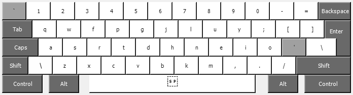
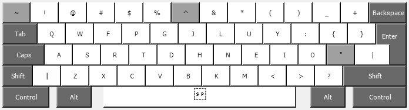
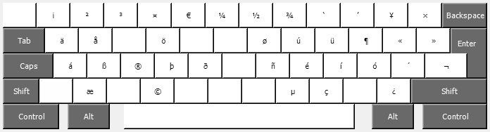
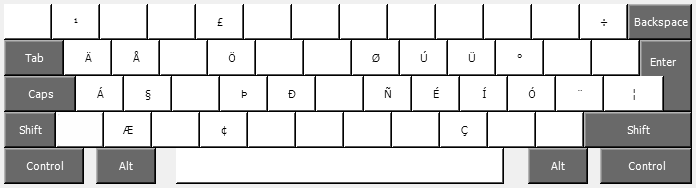

# Reismak International

1. Start with the US International layout.
2. Change all (and only) the letter keys to match the Colemak layout.
3. Swap the `R` and `S` keys (so that Ctrl-S still works).

## Layout

## Layout (Shift)

## Layout (AltGr)

## Layout (AltGr Shift)

